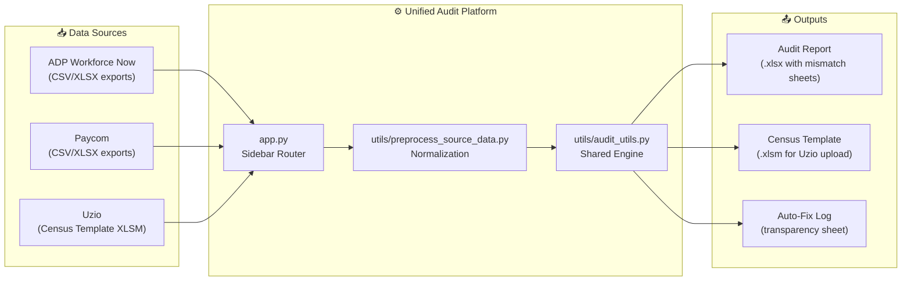
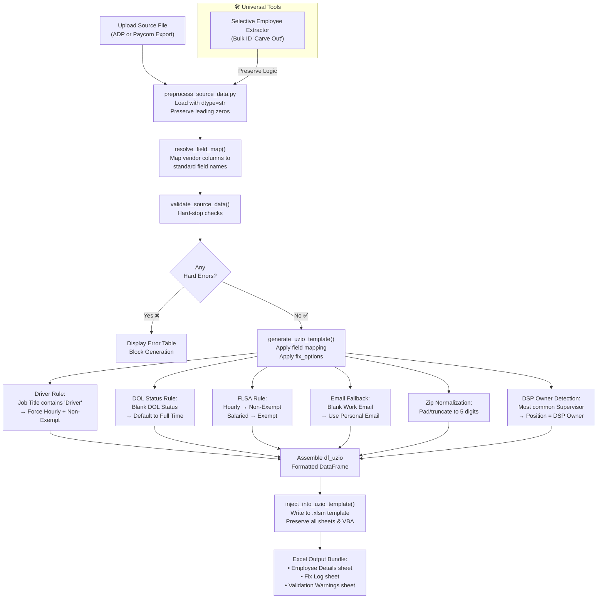
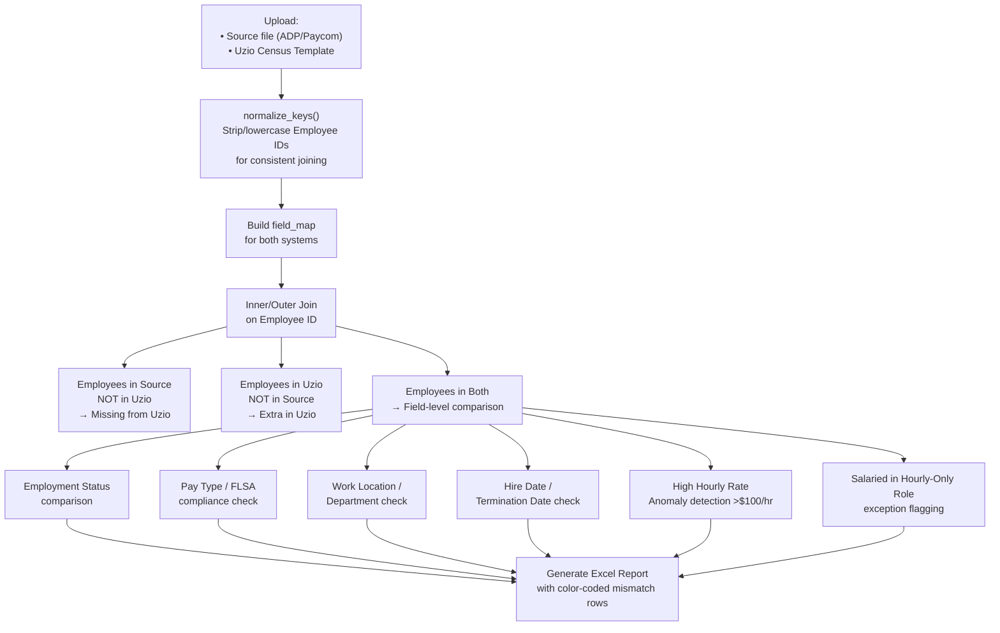

# 🛡️ Unified HR Audit Platform: Uzio, ADP & Paycom

> **Repository:** [github.com/shobhit73/ADP-Deduction-Tool-Audit](https://github.com/shobhit73/ADP-Deduction-Tool-Audit)
>
> A production-grade Streamlit web application for auditing, reconciling, and generating HR/Payroll data across **Uzio**, **ADP Workforce Now**, and **Paycom** systems.

---

## 📋 Table of Contents
- [Overview](#overview)
- [Architecture](#architecture)
- [Data Flow](#data-flow)
- [Module Reference](#module-reference)
  - [ADP Tools](#adp-tools)
  - [Paycom Tools](#paycom-tools)
- [Census Generator Deep Dive](#census-generator-deep-dive)
- [Auto-Fix Logic](#auto-fix-logic)
- [Project Structure](#project-structure)
- [Getting Started](#getting-started)
- [Key Data Mappings](#key-data-mappings)

---

## Overview

The **Unified HR Audit Platform** solves the problem of manual cross-system reconciliation between three HR systems that each store employee data differently. It automates:

1. **Auditing**: Compare records between ADP/Paycom ↔ Uzio and highlight every field-level mismatch.
2. **Census Generation**: Convert raw ADP/Paycom exports into the Uzio upload template format.
3. **Prior Payroll**: Transform prior payroll files into the Uzio import format with smart code mapping.

The entire application is driven by a single `app.py` router that dispatches to 15+ independent tool modules based on sidebar selection — no page reloads, no separate URLs.

---

## Architecture

```mermaid
graph TD
    A[Browser: Streamlit UI] --> B[app.py — Main Router]

    B --> C1[ADP Tools]
    B --> C2[Paycom Tools]
    B --> C3[Shared Utils]

    C1 --> D1[apps/adp/census_audit.py]
    C1 --> D2[apps/adp/census_generator.py]
    C1 --> D3[apps/adp/deduction_audit.py]
    C1 --> D4[apps/adp/payment_audit.py]
    C1 --> D5[apps/adp/withholding_audit.py]
    C1 --> D6[apps/adp/prior_payroll_audit.py]
    C1 --> D7[apps/adp/prior_payroll_generator.py]
    C1 --> D8[apps/adp/emergency_audit.py]
    C1 --> D9[apps/adp/license_audit.py]
    C1 --> D10[apps/adp/timeoff_audit.py]

    C2 --> E1[apps/paycom/census_audit.py]
    C2 --> E2[apps/paycom/census_generator.py]
    C2 --> E3[apps/paycom/deduction_audit.py]
    C2 --> E4[apps/paycom/payment_audit.py]
    C2 --> E5[apps/paycom/withholding_audit.py]
    C2 --> E6[apps/paycom/prior_payroll_generator.py]
    C2 --> E7[apps/paycom/emergency_audit.py]
    C2 --> E8[apps/paycom/timeoff_audit.py]

    C3 --> F1[utils/audit_utils.py]
    C3 --> F2[utils/preprocess_source_data.py]
    C3 --> F3[utils/withholding_core.py]

    C4[Common Tools]
    B --> C4
    C4 --> G1[apps/common/employee_extractor.py]
```



---

## Data Flow

### High-Level Data Flow



### Census Generator Flow (Detailed)



### Audit Reconciliation Flow (Census Audit)



---

## Module Reference

### ADP Tools

| Tool | Module | Purpose |
|---|---|---|
| **Census Audit** | `apps/adp/census_audit.py` | Field-by-field comparison of ADP vs. Uzio census data. Detects FLSA issues, missing employees, anomalies. |
| **Census Sanity Check** | `apps/adp/census_generator.py` → `render_sanity_check()` | Pre-generation validation: hard errors, FLSA mismatches, blank fields. |
| **Full Census Generation** | `apps/adp/census_generator.py` → `render_generator()` | Full ADP→Uzio conversion with all auto-fix options. |
| **Selective Census Sync** | `apps/adp/census_generator.py` → `render_selective_sync()` | Update specific columns in an existing Uzio template from ADP source. |
| **Deduction Audit** | `apps/adp/deduction_audit.py` | Compares deduction codes and amounts between ADP and Uzio. |
| **Payment & Emergency Audit** | `apps/adp/payment_audit.py` + `emergency_audit.py` | Reviews bank account and emergency contact data. |
| **Withholding Audit** | `apps/adp/withholding_audit.py` | Audits Federal/State tax withholding parameters. |
| **Prior Payroll Audit** | `apps/adp/prior_payroll_audit.py` | Transforms prior payroll input files into a grouped, wide-format validation report. |
| **Prior Payroll Generator** | `apps/adp/prior_payroll_generator.py` | Converts prior payroll data into Uzio import format. |
| **License Audit** | `apps/adp/license_audit.py` | Audits driver license numbers and expiration dates. |
| **Time Off Audit** | `apps/adp/timeoff_audit.py` | Reconciles PTO/vacation balances and accruals. |

### Paycom Tools

| Tool | Module | Purpose |
|---|---|---|
| **Census Audit** | `apps/paycom/census_audit.py` | Field-by-field comparison of Paycom vs. Uzio. Includes DSP Owner detection and rate anomaly checks. |
| **Census Sanity Check** | `apps/paycom/census_generator.py` → `render_sanity_check()` | Pre-generation validation. Identifies Drivers with blank FLSA/Pay, blank DOL statuses. |
| **Full Census Generation** | `apps/paycom/census_generator.py` → `render_generator()` | Full Paycom→Uzio conversion with DSP Owner logic and all auto-fix options. |
| **Selective Census Sync** | `apps/paycom/census_generator.py` → `render_selective_sync()` | Update specific columns in an existing Uzio template from Paycom source. |
| **Deduction Audit** | `apps/paycom/deduction_audit.py` | Compares Paycom deduction data against Uzio. |
| **Payment Audit** | `apps/paycom/payment_audit.py` | Auto-unpivots Paycom's wide bank format and compares vs. Uzio accounts. |
| **Withholding Audit** | `apps/paycom/withholding_audit.py` | Validates Paycom withholding parameters against Uzio. Handles cents vs. dollars formatting. |
| **Prior Payroll Generator** | `apps/paycom/prior_payroll_generator.py` | Smart code-mapping with `difflib` to convert Paycom prior payroll to Uzio format. |
| **Emergency Audit** | `apps/paycom/emergency_audit.py` | Reviews emergency contact data from Paycom vs. Uzio. |
| **Time Off Audit** | `apps/paycom/timeoff_audit.py` | Reconciles Paycom PTO/vacation data against Uzio. |

### Common Tools

| Tool | Module | Purpose |
|---|---|---|
| **Selective Employee Extractor** | `apps/common/employee_extractor.py` | Extract a specific subset of employees from ANY census while preserving all original formatting and leading zeros. |

---

## Census Generator Deep Dive

The Census Generator is the most complex module. It is split into **three independent tools** per vendor:

### 1. Sanity Check Tool
```
Purpose: Run BEFORE generating the census. Reveals all data quality issues.
Output: Excel report with multiple validation sheets.
```

**Checks performed:**

| Check | Severity | Auto-Fix Available |
|---|---|---|
| **Duplicate Column Header** | 🔴 Critical Error | No — Must Delete Duplicates |
| Blank SSN | 🔴 Hard Error | No |
| **Inactive/Terminated missing Date** | 🔴 Hard Error | ✅ Yes — converted to Active + Payroll Exclusion warning |
| Blank Employment Type / DOL Status | 🟡 Warning | ✅ Yes — defaults to Full Time |
| Blank Pay Type (non-Driver) | 🔴 Hard Error | No |
| Blank Pay Type (Driver) | 🟡 Warning | ✅ Yes — forced to Hourly |
| Blank FLSA Classification | 🟡 Warning | ✅ Yes — inferred from Pay Type / Job Title |
| Blank FLSA + Blank Pay (Driver) | 🟡 Warning | ✅ Yes — Non-Exempt / Hourly |
| Blank Job Title | 🟡 Warning | ✅ Yes — fallback to Department |
| Blank Work Location | 🔴 Hard Error | No |
| Invalid Zip Code (not 5 digits) | 🔴 Hard Error | ✅ Yes — padded/truncated |
| Salaried employee in Hourly-Only role | 🔴 Hard Error | ✅ Yes — convert to Hourly |
| Invalid State (full name instead of abbreviation) | 🔴 Hard Error | No |
| Termination Date before Hire Date | 🔴 Hard Error | No |
| Blank Working Hours | 🟡 Warning | ✅ Yes — default to 40 |
| Blank Work Email | 🟡 Warning | ✅ Yes — fallback to Personal Email |
| High Hourly Rate (> $100/hr) | 🔵 Anomaly | No |

### 2. Full Census Generation Tool
```
Purpose: Generate a complete Uzio census template from scratch.
Output: Populated Uzio .xlsm template + Fix Log sheet.
```

### 3. Selective Sync Tool
```
Purpose: Update SPECIFIC columns in an existing Uzio template from source data.
Output: Updated .xlsm template showing only changed rows/fields.
```

---

## Auto-Fix Logic

### Driver Rule (Highest Priority)
```python
# Rule: Any employee with "Driver" in their Job Title
IF job_title CONTAINS "driver", "lead driver", "helper", etc. (case-insensitive):
    Pay Type*        → "Hourly"
    FLSA Classification → "Non-Exempt"
    # This overrides whatever is in the source, even if blank or marked as Salaried/Exempt
```

### DOL Status Auto-Fill
```python
# Rule: Blank DOL Status → default to Full Time
IF dol_status IS BLANK OR NULL:
    Employment Type* → "Full Time"
    # Logged in Fix Log sheet for user visibility
```

### FLSA Alignment
```python
# Rule: Enforce alignment between Pay Type and FLSA
IF job_title contains "Driver":
    FLSA Classification → "Non-Exempt" (Forced)
ELSE IF pay_type == "Hourly":
    FLSA Classification → "Non-Exempt"
ELSE IF pay_type == "Salaried":
    FLSA Classification → "Exempt"
IF FLSA is still BLANK after above:
    FLSA Classification → "Non-Exempt"  # Safe default
```

### DSP Owner Detection (Paycom Only)
```python
# Rule: Most common supervisor → DSP Owner
most_common_supervisor = df['Supervisor_Primary_Code'].value_counts().idxmax()
IF employee_id == most_common_supervisor:
    Position → "DSP Owner"
    # Sorted to TOP of output file
```

### Email Fallback
```python
# Rule: Blank work email → use personal email
IF work_email IS BLANK:
    work_email → personal_email  # if personal_email is available
    # Logged in Fix Log for transparency
```

### Job Title Fallback
```python
# Rule: Blank position → use Department Description
IF position IS BLANK:
    position → department_desc  # ALWAYS department_desc, NEVER department_code
```

---

## Project Structure

```
ADP-Deduction-Tool-Audit/
│
├── app.py                          # 🏠 Main Streamlit router & sidebar navigation
├── requirements.txt                # Python dependencies
│
├── apps/
│   ├── adp/                        # All ADP-specific tool modules
│   │   ├── census_audit.py         # ADP vs. Uzio field comparison engine
│   │   ├── census_generator.py     # Sanity / Full Gen / Selective Sync (3-in-1)
│   │   ├── deduction_audit.py
│   │   ├── payment_audit.py
│   │   ├── emergency_audit.py
│   │   ├── withholding_audit.py
│   │   ├── prior_payroll_audit.py
│   │   ├── prior_payroll_generator.py
│   │   ├── license_audit.py
│   │   └── timeoff_audit.py
│   │
│   └── paycom/                     # All Paycom-specific tool modules
│       ├── census_audit.py         # Paycom vs. Uzio field comparison engine
│       ├── census_generator.py     # Sanity / Full Gen / Selective Sync (3-in-1)
│       ├── deduction_audit.py
│       ├── payment_audit.py
│       ├── emergency_audit.py
│       ├── withholding_audit.py
│       ├── prior_payroll_generator.py
│       └── timeoff_audit.py
│
├── utils/
│   ├── audit_utils.py              # 🔧 Core shared engine
│   │                               #    generate_uzio_template()
│   │                               #    validate_source_data()
│   │                               #    inject_into_uzio_template()
│   │                               #    selective_update_uzio()
│   │                               #    + all auto-fix logic
│   ├── preprocess_source_data.py   # Raw file loading & normalization
│   └── withholding_core.py         # Shared withholding audit logic
│
├── templates/
│   └── Uzio_Census_Template.xlsm   # 📄 Base Uzio upload template (required)
│
├── docs/
│   └── README.md                   # This file
│
└── data/                           # Local test data (gitignored)
```

---

## Getting Started

### Prerequisites
- Python 3.8+
- pip

### Installation

```bash
# 1. Clone the repository
git clone https://github.com/shobhit73/ADP-Deduction-Tool-Audit.git
cd ADP-Deduction-Tool-Audit

# 2. (Recommended) Create a virtual environment
python -m venv .venv
source .venv/bin/activate   # Windows: .venv\Scripts\activate

# 3. Install dependencies
pip install -r requirements.txt
```

### Running the Application

```bash
streamlit run app.py
```

The application will open at **`http://localhost:8501`**.

> ⚠️ **Important**: The Census Generator tools require `templates/Uzio_Census_Template.xlsm` to be present in the project root. This file is not committed to the repository due to its proprietary format — ensure it is placed before running those tools.

---

## Key Data Mappings

### ADP → Uzio Field Mapping (Core Fields)

| Uzio Field | ADP Source Column |
|---|---|
| First Name | First Name |
| Last Name | Last Name |
| Employee ID | File Number |
| SSN | SSN |
| DOB | Birth Date |
| Hire Date | Adjusted Service Date |
| Employment Status | Status |
| Employment Type | Employment Type |
| Pay Type | Pay Type |
| FLSA Classification | FLSA |
| Annual Salary | Annual Salary |
| Hourly Rate | Hourly Amount |
| Job Title | Home Job Title |
| Work Location | Location Description |
| Department | Home Org Unit 3 |
| State | Home State |
| Zip | Home Zip |
| Work Email | Work Email |

### Paycom → Uzio Field Mapping (Core Fields)

| Uzio Field | Paycom Source Column |
|---|---|
| First Name | Legal_First_Name |
| Last Name | Legal_Last_Name |
| Employee ID | Employee_Code |
| SSN | SSN |
| DOB | Date_of_Birth |
| Hire Date | Hire_Date |
| Employment Status | Employee_Status |
| Employment Type | DOL_Status |
| Pay Type | Pay_Type |
| FLSA Classification | Exempt_status |
| Annual Salary | Annual_Salary |
| Hourly Rate | Payrate |
| Job Title | Position |
| Work Location | Location_Description |
| Department | Department_Desc |
| State | Home_State |
| Zip | Home_Zip |
| Work Email | Work_Email |
| Personal Email | Personal_Email |

---

## Sidebar Navigation

```
AUDIT PLATFORM
└── ADP TOOLS
    ├── Census Audit
    ├── ADP Census Sanity Check       ← New independent tool
    ├── ADP Full Census Generation    ← New independent tool
    ├── ADP Selective Census Sync     ← New independent tool
    ├── Deduction Audit
    ├── Payment & Emergency Audit
    ├── Withholding Audit
    ├── Prior Payroll Audit
    ├── Prior Payroll Generator
    ├── License Audit
    └── Time Off Audit
└── PAYCOM TOOLS
    ├── Census Audit
    ├── Paycom Census Sanity Check    ← New independent tool
    ├── Paycom Full Census Generation ← New independent tool
    ├── Paycom Selective Census Sync  ← New independent tool
    ├── Deduction Audit
    ├── Payment Audit
    ├── Withholding Audit
    ├── Prior Payroll Generator
    ├── Emergency Audit
    └── Time Off Audit
```

---

*Maintained by Shobhit Sharma — Last updated March 2026*
